# io

[](http://godoc.org/github.com/jojomi/io)


[](https://goreportcard.com/report/jojomi/io)
[](https://github.com/jojomi/io/blob/master/LICENSE)

Take data, make documents!

## Overview



`io` is supposed to be a small and useful tool for reworking data from JSON, YAML, or CSV sources into any text or HTML format.

The templates used for the transformation feature all the elements of [Go Templates](https://pkg.go.dev/text/template)
plus a set of useful [functions](#template-functions).

Gems are the `exec` functions from `tplfuncs` that, combined with the line based matchers and filters,
can be used to create dynamic auto-generated documents.

## How to Use

```
Usage:
  io [flags]
  io [command]

Available Commands:
  completion  Generate the autocompletion script for the specified shell
  help        Help about any command
  version     

Flags:
      --allow-exec              allow execution of commands during templating phase
  -h, --help                    help for io
  -i, --input string            input filename including extension optionally with path, or inline JSON if first char is { (default "{}")
  -o, --output string           output filename including extension optionally with path
  -w, --overwrite stringArray   overwrite input data by path (for YML and JSON inputs only)
  -t, --template string         template filename including extension optionally with path

Use "io [command] --help" for more information about a command.

```

## Example

With input data from [test/input/simple.yml](test/input/simple.yml)

``` yml
creator:
  name: John Doe
  age: 54
```

and the template [test/template/creator.html](test/template/creator.html)

``` yml
<h1>
    Creator:
    {{ .creator.name }}
    ( {{- .creator.age }}yo)
</h1>
```

you can use `io` to get this result:

``` shell
> io -i test/input/simple.yml -t test/template/creator.html
<h1>
    Creator:
    John Doe
    (54yo)
</h1>
```

If you want to overwrite values from the input data uses `--overwrite` like this:
``` shell
> io --input test/input/simple.yml --template test/template/creator.html --overwrite creator.age=62 --overwrite creator.name=Walther
<h1>
    Creator:
    Walther
    (62yo)
</h1>
```


## Template Functions

* all functions defined in [Masterminds/**sprig**](http://masterminds.github.io/sprig/)
* all functions defined in [jojomi/**tplfuncs**](https://github.com/jojomi/tplfuncs) (the `exec*` variants are only avaiable when `--allow-exec` is given when calling `io` due to security implications)

A quick introduction to Golang Templates can be found at [Hugo](https://gohugo.io/templates/introduction).

## How to Install

``` shell
go install github.com/jojomi/io@latest
```

## Who uses it?

`io` does [itself](https://en.wikipedia.org/wiki/Eating_your_own_dog_food), see [build.sh](build.sh) which generates this very document from [docu/README.tpl.md](docu/README.tpl.md). It shows how to use `exec` functions as well, but does not take dynamic input data.